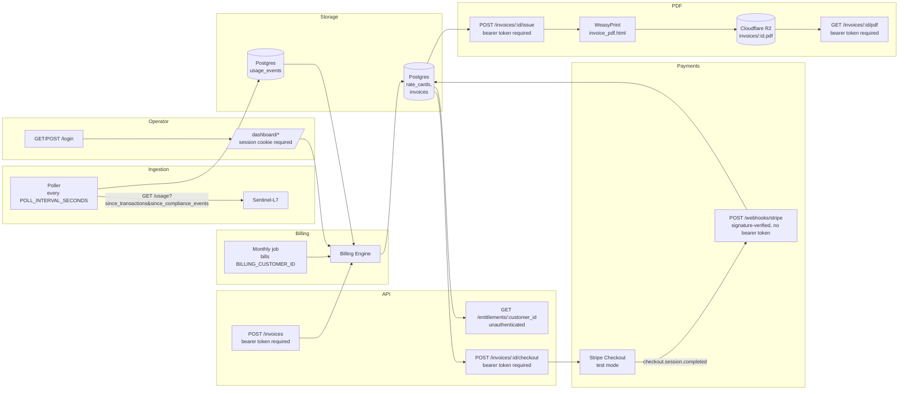

# Ledger-L5

Ledger-L5 is a **billing and usage-metering service** for Sentinel-L7. It pulls usage events on a schedule, tracks per-customer entitlements, issues invoices, and now has a small operator dashboard for looking at all of that.

Architecturally, this project is being built ADR-first: each build phase produces a committed Architecture Decision Record before any code that implements it. See [Roadmap](#️-roadmap) below for the phase order.

---

## 📋 Contents

- [🧰 Stack](#-stack)
- [🚀 Running the Project](#-running-the-project)
- [🏗️ Architecture](#-architecture)
- [📚 Docs](#-docs)
- [🗺️ Roadmap](#️-roadmap)
  - [📋 Planned](#-planned)
  - [🐛 Known issues](#-known-issues)

## 🧰 Stack

- **Python 3.12**
- **FastAPI** — HTTP layer
- **Pydantic v2** — request/response schema validation
- **uv** — dependency management and virtual environments
- **Postgres on [Neon](https://neon.tech)** — sole data store; `main` branch for dev, `test` branch for the pytest suite
- **SQLAlchemy 2.0** (sync, `psycopg` v3 driver) + **Alembic** — models and migrations
- **pytest** + **factory_boy** — test stack, run against real Postgres (not SQLite) — see [ADR 0011](docs/adr/0011-test-stack.md)
- **httpx** — Sentinel-L7 usage-pull client ([ADR 0003](docs/adr/0003-pull-not-push.md), [ADR 0005](docs/adr/0005-sentinel-l7-usage-pull-contract.md))
- **APScheduler** (in-process `BackgroundScheduler`) — real scheduling for the poller and monthly invoice generation ([ADR 0010](docs/adr/0010-scheduling.md))
- **Jinja2** (FastAPI's built-in `Jinja2Templates`) + **HTMX** (CDN, loaded but not yet used) — server-rendered operator dashboard, no SPA/JS build ([ADR 0012](docs/adr/0012-operator-auth-and-dashboard.md))
- **`stripe`** (official Python SDK) — test-mode-only Checkout Sessions and webhook signature verification for payment collection ([ADR 0013](docs/adr/0013-stripe-for-payment-collection-only.md))
- **WeasyPrint** — renders `invoice_pdf.html` to PDF bytes ([ADR 0014](docs/adr/0014-pdf-invoice-generation-weasyprint.md)); deployed on Railway via a root `railpack.json` (`deploy.aptPackages`) rather than a `nixpacks.toml` — Railway's current default builder is Railpack, not classic Nixpacks
- **`boto3`** — S3-compatible client pointed at Cloudflare R2 for durable invoice PDF storage ([ADR 0015](docs/adr/0015-cloudflare-r2-invoice-pdf-storage.md))
- Money columns (`unit_rate`, `line_total`) are `NUMERIC`/`Decimal`, never `float` — avoids floating-point imprecision in billing math

See [ADR 0001](docs/adr/0001-build-ledger-l5-in-python-fastapi.md) for why this stack was chosen over the `ledger-l5-rails` prior art.

## 🚀 Running the Project

### ✅ Prerequisites

- **Python 3.12+**
- **[uv](https://docs.astral.sh/uv/)**
- A `.env` with `DATABASE_URL` pointing at the Neon `main` branch, plus `OPERATOR_API_TOKEN`, `SESSION_SECRET_KEY`, `STRIPE_SECRET_KEY`, `STRIPE_WEBHOOK_SECRET`, `R2_ACCOUNT_ID`, `R2_ACCESS_KEY_ID`, `R2_SECRET_ACCESS_KEY`, and `R2_BUCKET_NAME` (all eight required — the app fails to start without them, same as `DATABASE_URL`; see `.env.example`). Stripe keys must be **test-mode** (`sk_test_...`/`whsec_...`) — ADR 0013. R2 credentials are a scoped R2 API token pair, not a Cloudflare account login — ADR 0015.

### ⚡ Quick Start

```bash
# 1. Install dependencies
uv sync

# 2. Apply migrations
uv run alembic upgrade head

# 3. Start the app
uv run uvicorn app.main:app --reload

# 4. Open the interactive API docs
open http://localhost:8000/docs

# 5. Or log into the operator dashboard directly
open http://localhost:8000/login
```

Starting the app also starts the in-process scheduler (poller every `POLL_INTERVAL_SECONDS`, monthly invoice job on the 1st — [ADR 0010](docs/adr/0010-scheduling.md)), which will try to reach `sentinel_l7_base_url` for real. If Sentinel-L7 isn't actually running locally, set `ENABLE_SCHEDULER=false` in `.env` to start the app without it — `POST /invoices` still works for manual/smoke-test runs either way.

At `/login`, enter `OPERATOR_API_TOKEN`'s value as the token to reach the dashboard (`/dashboard/invoices`, `/dashboard/usage-events`, `/dashboard/generate-invoice`). API clients skip the login form and send `Authorization: Bearer <OPERATOR_API_TOKEN>` directly — required now on `POST /invoices` ([ADR 0012](docs/adr/0012-operator-auth-and-dashboard.md)).

### 🧪 Running Tests

Tests run against the Neon `test` branch, configured via `.env.test`:

```bash
uv run pytest
```

Domain logic covers Phases 1–9 so far (foundations, usage ingestion, entitlements, billing engine, scheduling, operator auth/dashboard, Stripe payment collection, PDF invoice generation, R2 PDF storage). The test suite runs with `ENABLE_SCHEDULER=false` (`.env.test`) so it never starts a real background scheduler, and never calls a real Stripe or R2 API — `StripeClient` is only exercised through a hand-written `FakeStripeClient`, `R2Client` only through a hand-written `FakeObjectStorageClient`, and webhook signature verification is tested against real HMAC signatures signed with the test-only `STRIPE_WEBHOOK_SECRET`. Seed a placeholder rate card with:

```bash
uv run python -m scripts.seed_rate_card
```

## 🏗️ Architecture

`customers` (UUID PK, no tenant isolation — [ADR 0007](docs/adr/0007-customer-model-no-multi-tenancy.md)) and `usage_events` (pulled from Sentinel-L7, classified per its ADR-0028 at pull time — [ADR 0005](docs/adr/0005-sentinel-l7-usage-pull-contract.md)) exist so far. Note `usage_events` has no `customer_id`: Sentinel-L7 has no customer/tenant model to pull one from (its own ADR-0020) — an open gap Phase 4 will have to resolve. The poll cursor is two independent integers (`since_transactions`, `since_compliance_events`), not a timestamp — [ADR 0003](docs/adr/0003-pull-not-push.md) — per Sentinel-L7's own companion ADR-0029 for the actual endpoint contract; not yet exercised against a live Sentinel-L7. `GET /entitlements/{customer_id}` ([ADR 0004](docs/adr/0004-entitlement-throttle-poll-endpoint.md)) is live but stubbed — always `throttled: false` until the billing engine's real throttle rules are wired in (not yet — only rating/invoicing exist so far). `rate_cards` (customer-specific overrides a nullable-customer_id product default), `invoices`, and `invoice_line_items` exist per [ADR 0008](docs/adr/0008-configurable-billing-rules-engine.md)/[ADR 0009](docs/adr/0009-immutable-historical-invoices.md) — line items snapshot their rate at issue time, so editing `rate_cards` afterward never changes an issued invoice. Note invoice generation bills *all* billable usage for a product/metric/period to whichever customer is invoiced, unscoped by customer — `usage_events` still has no `customer_id` (Sentinel-L7 has no tenant model), correct only while there's one implicit customer. That's why the automatic invoice job (below) bills exactly one designated customer rather than looping every row in `customers` — see [ADR 0010](docs/adr/0010-scheduling.md).

The poller and invoice generation are wired to an in-process scheduler ([ADR 0010](docs/adr/0010-scheduling.md)) — the poller runs every `POLL_INTERVAL_SECONDS` (default 60), and a monthly job bills the customer named by `BILLING_CUSTOMER_ID` for the previous calendar month (a no-op, logged as an error, until that setting is configured). `POST /invoices` generates a draft invoice on demand for any customer and any `period_start`/`period_end` — the way to bill someone other than the designated customer, or smoke-test a specific historical range.

Operator auth and a dashboard exist as of Phase 6 ([ADR 0012](docs/adr/0012-operator-auth-and-dashboard.md)): a static bearer token (`OPERATOR_API_TOKEN`), checked directly via `Authorization: Bearer <token>` on `POST /invoices`, or via a signed session cookie (set by `/login`) on the server-rendered `/dashboard/*` pages (invoice list/detail, usage events, a manual generate-invoice form — same `create_draft_invoice` code path `POST /invoices` uses, not a second one). `GET /entitlements/{customer_id}` is the one deliberate exception, left unauthenticated on purpose — it's Sentinel-L7 polling machine-to-machine, a different consumer with a different (fail-open) contract, ADR 0004.

Stripe payment collection exists as of Phase 7 ([ADR 0013](docs/adr/0013-stripe-for-payment-collection-only.md)): `POST /invoices/{id}/checkout` (behind the same `require_operator_json` as `POST /invoices`) creates a test-mode Stripe Checkout Session for an `issued` invoice's total, idempotently — a repeat call reuses the existing session's URL as long as it's still `open`, only minting a new one if none exists yet or the prior one expired. `POST /webhooks/stripe` is the one route with no operator-token auth at all — it verifies the `Stripe-Signature` header over the raw request body instead, resolves the invoice via Stripe's own echoed-back `metadata.invoice_id` (never the mutable `stripe_checkout_session_id` column), and moves `issued → paid` on `checkout.session.completed`. A `stripe_events` table records processed event IDs so a retried webhook delivery is a no-op, not a second state transition. Stripe never meters usage or finalizes an invoice — both stay entirely internal; it is only ever told a final number and asked to collect it.

PDF invoice generation exists as of Phase 8 ([ADR 0014](docs/adr/0014-pdf-invoice-generation-weasyprint.md)): `app/services/invoice_pdf.py`'s `render_invoice_pdf(invoice, line_items)` is a pure rendering function — no DB session, no storage — that renders the standalone `app/templates/invoice_pdf.html` template (a separate template from the dashboard's `invoice_detail.html`, deliberately not sharing HTMX/nav chrome) via WeasyPrint into PDF bytes. WeasyPrint's Pango/HarfBuzz system-library dependency is satisfied on Railway via a root `railpack.json` (`deploy.aptPackages`), since Railway's current builder (Railpack) needs the libraries in the final runtime image, not just the build step.

Invoice PDF storage exists as of Phase 9 ([ADR 0015](docs/adr/0015-cloudflare-r2-invoice-pdf-storage.md)): `POST /invoices/{id}/issue` (behind the same `require_operator_json` as `POST /invoices`) is the one route in the system that calls `transition_status(invoice, "issued")` — no route did before this phase, since Phases 6/7's dashboard and `/checkout` only ever operated on already-issued invoices by some unspecified means. In the same request, `app/services/invoice_pdf.py`'s `generate_and_store_pdf` renders the PDF and uploads it to Cloudflare R2 (`app/integrations/object_storage.py`, an S3-API-compatible `boto3` client pointed at R2's endpoint, same shape as `stripe.py`/`sentinel_l7.py`) under the deterministic key `invoices/{invoice_id}.pdf`, stored on `invoices.pdf_object_key` once upload succeeds. An R2 upload failure is caught and logged, not raised — the invoice still transitions to `issued` either way (ADR 0009's financial-authority boundary takes precedence over a downstream storage call), leaving `pdf_object_key` null, a legitimate degraded state. `GET /invoices/{id}/pdf` (same auth) streams the object back through this system's own auth rather than a public or presigned R2 URL, 404ing if no PDF has been generated yet. Phase 8's temporary `POST /invoices/{id}/pdf/preview` route is retired now that a permanent, persisted path exists.



Domain code is organized by phase — usage ingestion (Phase 2), entitlements (Phase 3), billing engine (Phase 4), scheduling (Phase 5), operator auth and dashboard (Phase 6), Stripe payment collection (Phase 7), PDF invoice generation (Phase 8), R2 PDF storage (Phase 9).

## 📚 Docs

| File | Contents |
| --- | --- |
| [README.md](README.md) | Project overview |
| [adr/](docs/adr/) | Architecture Decision Records |
| [journal/](docs/journal/) | Engineering journal — one entry per phase |
| [probes/](docs/probes/) | Anki spaced-repetition probe cards, paired with journal entries |

## 🗺️ Roadmap

### 📋 Planned

- [x] **Phase 0 — Repo scaffold:** `uv`-managed FastAPI + Pydantic v2 skeleton, `docs/adr/` established. ([ADR 0001](docs/adr/0001-build-ledger-l5-in-python-fastapi.md))
- [x] **Phase 1 — Foundations:** pytest + factory_boy test stack against real Postgres (Neon branches), UUID primary keys, `customers` table, no multi-tenancy. ([ADR 0002](docs/adr/0002-uuid-primary-keys.md), [ADR 0007](docs/adr/0007-customer-model-no-multi-tenancy.md), [ADR 0011](docs/adr/0011-test-stack.md))
- [x] **Phase 2 — Usage ingestion:** pull contract with Sentinel-L7, `usage_events` table, ADR-0028 billing classification at pull time. ([ADR 0003](docs/adr/0003-pull-not-push.md), [ADR 0005](docs/adr/0005-sentinel-l7-usage-pull-contract.md), [ADR 0006](docs/adr/0006-single-hardcoded-product-no-plugin-system.md))
- [x] **Phase 3 — Entitlement/throttle poll endpoint:** `GET /entitlements/:customer_id`, stubbed throttled:false, caller-side fail-open documented. ([ADR 0004](docs/adr/0004-entitlement-throttle-poll-endpoint.md))
- [x] **Phase 4 — Billing engine:** rate cards, override precedence, append-only invoices — rate snapshotted onto line items at issue time. ([ADR 0008](docs/adr/0008-configurable-billing-rules-engine.md), [ADR 0009](docs/adr/0009-immutable-historical-invoices.md))
- [x] **Phase 5 — Scheduling:** in-process scheduler polls on an interval and bills one designated customer monthly; `POST /invoices` covers any customer/custom range on demand; minimal Railway `Procfile` added. ([ADR 0010](docs/adr/0010-scheduling.md))
- [x] **Phase 6 — Operator auth and dashboard:** static bearer-token auth (also now required on `POST /invoices`); server-rendered Jinja2 dashboard for invoices, usage events, and manual invoice generation. ([ADR 0012](docs/adr/0012-operator-auth-and-dashboard.md))
- [x] **Phase 7 — Stripe payment collection:** `POST /invoices/{id}/checkout` creates a test-mode Stripe Checkout Session for an issued invoice (idempotent per invoice); `POST /webhooks/stripe` verifies signatures and moves `issued → paid` on `checkout.session.completed`, resolved via Stripe session metadata, not the mutable session-ID column. ([ADR 0013](docs/adr/0013-stripe-for-payment-collection-only.md))
- [x] **Phase 8 — PDF invoice generation:** WeasyPrint renders a dedicated `invoice_pdf.html` template to PDF bytes via `app/services/invoice_pdf.py`; exercised through a temporary, operator-authenticated preview route (`POST /invoices/{id}/pdf/preview`, not persisted, not yet wired to `transition_status`) that validates the template and the Railway/Railpack `deploy.aptPackages` build path end to end — verified against a live Railpack-format `railpack.json` and a real WeasyPrint render, not just unit tests. Permanent wiring into the `issued` transition is deferred to Phase 9, once storage exists. ([ADR 0014](docs/adr/0014-pdf-invoice-generation-weasyprint.md) — Accepted)
- [x] **Phase 9 — Invoice PDF storage (Cloudflare R2):** `POST /invoices/{id}/issue` (new — no route called `transition_status(invoice, "issued")` before this phase) transitions a draft invoice, renders its PDF, and uploads it to R2 (`invoices/{invoice_id}.pdf`, key stored on `invoices.pdf_object_key`) in one request; upload failure is logged but never fails the transition. Retrieved via `GET /invoices/{id}/pdf`, streamed under the same operator auth as `POST /invoices`; Phase 8's preview route is retired. Verified against a live R2 bucket, not just unit tests — issued a real invoice, confirmed the object via a raw `boto3` list call against the bucket, and downloaded it back through the route. ([ADR 0015](docs/adr/0015-cloudflare-r2-invoice-pdf-storage.md) — Accepted)

### 🐛 Known issues

Each item below is a deliberate scope boundary from the ADR that set it, not an oversight — read as "true today, revisit when," not "broken."

#### Single-customer scope (by design — no second customer exists yet)
- **Invoice generation is unscoped by customer.** `usage_events` has no `customer_id`; `create_draft_invoice` bills all billable usage for a product/metric/period to whichever single customer it's given. Correct today because exactly one customer exists. **Revisit when:** Sentinel-L7 (or any product) can distinguish usage by customer — this aggregation logic changes at that point, not before. ([ADR 0005](docs/adr/0005-sentinel-l7-usage-pull-contract.md), [ADR 0008](docs/adr/0008-configurable-billing-rules-engine.md))

#### Blocked on a cross-repo dependency, not a Ledger-L5 gap
- **The Sentinel-L7 usage-pull contract has never run against a live Sentinel-L7.** Phase 2 is built and tested entirely against fixtures matching the documented `GET /usage` shape. **Revisit when:** Sentinel-L7's own ADR-0029 is Accepted and the endpoint is live — this is an explicit, named blocking dependency, not something Ledger-L5 can close unilaterally. ([ADR 0003](docs/adr/0003-pull-not-push.md), [ADR 0005](docs/adr/0005-sentinel-l7-usage-pull-contract.md))

#### Deliberately unauthenticated (one endpoint, one specific reason)
- **`GET /entitlements/{customer_id}` has no auth.** Phase 6 ([ADR 0012](docs/adr/0012-operator-auth-and-dashboard.md)) added bearer-token auth to `POST /invoices` and the whole `/dashboard/*` surface, but left this one endpoint open — it's Sentinel-L7 polling machine-to-machine, and ADR 0004's fail-open contract for that consumer is a different, still-valid design, not an oversight. No access control on the `customers` table directly either, beyond what the routes above enforce. **Revisit when:** this endpoint's consumer changes from "Sentinel-L7 only, trusted network" to something else. ([ADR 0004](docs/adr/0004-entitlement-throttle-poll-endpoint.md), [ADR 0007](docs/adr/0007-customer-model-no-multi-tenancy.md))

#### Stubbed pending a real rules decision
- **Entitlement throttling is entirely stubbed.** `GET /entitlements/{customer_id}` always returns `throttled: false`. Fail-open on unreachable/stale response is a documented expectation for callers, not enforced logic yet. **Revisit when:** real throttle rules are defined, downstream of the rate-card work in [ADR 0008](docs/adr/0008-configurable-billing-rules-engine.md) — not tied to a specific phase number ([ADR 0004](docs/adr/0004-entitlement-throttle-poll-endpoint.md) originally named Phase 4 as the trigger; Phase 4 shipped without wiring this, so that phase-based framing was corrected in the ADR itself rather than repeated here).

#### Stripe payment collection (ADR 0013 — deliberate scope boundaries)
- **No dedicated handling for an abandoned Checkout session.** Stripe pushes an `expired` event, not a distinct "canceled" one, when a payer closes the tab without paying. Not solved here: the idempotent-reuse behavior in `POST /invoices/{id}/checkout` means a payer who comes back later just resumes (or regenerates, once expired) the same flow. **Revisit if:** a real reason emerges to distinguish "abandoned" from "in progress" server-side rather than leaving it to Stripe's own session lifecycle. ([ADR 0013](docs/adr/0013-stripe-for-payment-collection-only.md))
- **No dashboard "Pay" button and no email delivery of the Checkout link yet.** Both are explicitly out of scope for this phase — a future "Pay" button would call `get_or_create_checkout_session` directly, the same way the existing generate-invoice dashboard form calls `create_draft_invoice` directly (Phase 6's established pattern), not a second HTTP call to `POST /invoices/{id}/checkout`. ([ADR 0013](docs/adr/0013-stripe-for-payment-collection-only.md))
- **Test mode only.** Switching to a live Stripe account (real API keys) is the concrete trigger for revisiting this ADR — nothing about the architecture changes, only the fact that a real charge becomes possible. ([ADR 0013](docs/adr/0013-stripe-for-payment-collection-only.md))

#### Billing-correctness hardening (app-layer today, needs a second layer before scale)
- **Invoice immutability is enforced by omission, not the database.** No service function mutates a line item or issued invoice's financial fields — but nothing at the DB level (trigger, `REVOKE UPDATE`) stops a direct SQL client or future admin tool from doing so. **Revisit when:** any tooling gets direct DB access beyond this service's own code path — the app-layer guarantee stops being sufficient at that point. ([ADR 0009](docs/adr/0009-immutable-historical-invoices.md))
- **No duplicate-invoice guard.** Neither the monthly scheduled job nor `POST /invoices` checks for an existing invoice covering the same customer/product/metric/period before calling `create_draft_invoice`. **Revisit when:** a multi-replica deploy becomes real, or a manual/dashboard-driven re-run actually creates a duplicate — whichever happens first; this is reachable today from a manual re-run alone, not only from replica scaling. ([ADR 0010](docs/adr/0010-scheduling.md))
- **Empty invoices are possible.** A zero-usage period still produces a draft invoice with zero line items. **Revisit when:** the zero-usage policy is actually decided — this is an open business-rule question (skip vs. issue a $0 invoice for record-keeping), not a defect either way. ([ADR 0010](docs/adr/0010-scheduling.md))

#### Invoice PDF storage (ADR 0015 — deliberate scope boundary)
- **No retry path for a failed R2 upload.** An issued invoice with `pdf_object_key IS NULL` means the upload failed at issue time; nothing re-attempts it automatically, and there's no manual "regenerate PDF" action either. **Revisit when:** a null `pdf_object_key` on an issued invoice is actually observed outside a test — the ADR names this explicitly as "worth a retry path if this becomes a real problem, not built preemptively." ([ADR 0015](docs/adr/0015-cloudflare-r2-invoice-pdf-storage.md))
