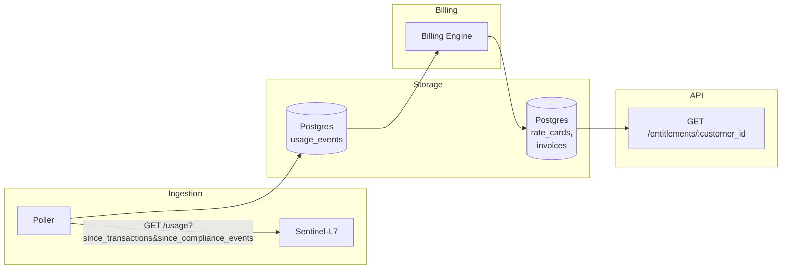

# Ledger-L5

Ledger-L5 is a **billing and usage-metering service** for Sentinel-L7. It pulls usage events on a schedule, tracks per-customer entitlements, and issues invoices — a service-to-service backend with no operator UI (yet).

Architecturally, this project is being built ADR-first: each build phase produces a committed Architecture Decision Record before any code that implements it. See [Roadmap](#-roadmap) below for the phase order.

---

## 📋 Contents

- [📋 Contents](#-contents)
- [🧰 Stack](#-stack)
- [🚀 Running the Project](#-running-the-project)
- [🏗️ Architecture](#-architecture)
- [📚 Docs](#-docs)
- [🗺️ Roadmap](#-roadmap)

## 🧰 Stack

- **Python 3.12**
- **FastAPI** — HTTP layer
- **Pydantic v2** — request/response schema validation
- **uv** — dependency management and virtual environments
- **Postgres on [Neon](https://neon.tech)** — sole data store; `main` branch for dev, `test` branch for the pytest suite
- **SQLAlchemy 2.0** (sync, `psycopg` v3 driver) + **Alembic** — models and migrations
- **pytest** + **factory_boy** — test stack, run against real Postgres (not SQLite) — see [ADR 0011](docs/adr/0011-test-stack.md)
- **httpx** — Sentinel-L7 usage-pull client ([ADR 0003](docs/adr/0003-pull-not-push.md), [ADR 0005](docs/adr/0005-sentinel-l7-usage-pull-contract.md))

See [ADR 0001](docs/adr/0001-build-ledger-l5-in-python-fastapi.md) for why this stack was chosen over the `ledger-l5-rails` prior art.

## 🚀 Running the Project

### ✅ Prerequisites

- **Python 3.12+**
- **[uv](https://docs.astral.sh/uv/)**
- A `.env` with `DATABASE_URL` pointing at the Neon `main` branch (see `.env.example`)

### ⚡ Quick Start

```bash
# 1. Install dependencies
uv sync

# 2. Apply migrations
uv run alembic upgrade head

# 3. Start the app
uv run uvicorn app.main:app --reload

# 4. Open the interactive API docs
open http://localhost:8000/docs
```

### 🧪 Running Tests

Tests run against the Neon `test` branch, configured via `.env.test`:

```bash
uv run pytest
```

Domain logic covers Phases 1–3 so far (foundations, usage ingestion, entitlements). No poller schedule exists yet — `app.services.usage_poller.poll_once()` runs on demand; real scheduling is Phase 5.

## 🏗️ Architecture

`customers` (UUID PK, no tenant isolation — [ADR 0007](docs/adr/0007-customer-model-no-multi-tenancy.md)) and `usage_events` (pulled from Sentinel-L7, classified per its ADR-0028 at pull time — [ADR 0005](docs/adr/0005-sentinel-l7-usage-pull-contract.md)) exist so far. Note `usage_events` has no `customer_id`: Sentinel-L7 has no customer/tenant model to pull one from (its own ADR-0020) — an open gap Phase 4 will have to resolve. The poll cursor is two independent integers (`since_transactions`, `since_compliance_events`), not a timestamp — [ADR 0003](docs/adr/0003-pull-not-push.md) — per Sentinel-L7's own companion ADR-0029 for the actual endpoint contract; not yet exercised against a live Sentinel-L7. `GET /entitlements/{customer_id}` ([ADR 0004](docs/adr/0004-entitlement-throttle-poll-endpoint.md)) is live but stubbed — always `throttled: false` until Phase 4's rate model exists. The planned shape, once Phases 4–5 land:



Domain code, once it exists, will be organized by phase — usage ingestion (Phase 2, done), entitlements (Phase 3, done), billing engine (Phase 4), scheduling (Phase 5).

## 📚 Docs

| File | Contents |
| --- | --- |
| [README.md](README.md) | Project overview |
| [adr/](docs/adr/) | Architecture Decision Records |
| [journal/](docs/journal/) | Engineering journal — one entry per phase |
| [probes/](docs/probes/) | Anki spaced-repetition probe cards, paired with journal entries |

## 🗺️ Roadmap

- [x] **Phase 0 — Repo scaffold:** `uv`-managed FastAPI + Pydantic v2 skeleton, `docs/adr/` established. ([ADR 0001](docs/adr/0001-build-ledger-l5-in-python-fastapi.md))
- [x] **Phase 1 — Foundations:** pytest + factory_boy test stack against real Postgres (Neon branches), UUID primary keys, `customers` table, no multi-tenancy. ([ADR 0002](docs/adr/0002-uuid-primary-keys.md), [ADR 0007](docs/adr/0007-customer-model-no-multi-tenancy.md), [ADR 0011](docs/adr/0011-test-stack.md))
- [x] **Phase 2 — Usage ingestion:** pull contract with Sentinel-L7, `usage_events` table, ADR-0028 billing classification at pull time. ([ADR 0003](docs/adr/0003-pull-not-push.md), [ADR 0005](docs/adr/0005-sentinel-l7-usage-pull-contract.md), [ADR 0006](docs/adr/0006-single-hardcoded-product-no-plugin-system.md))
- [x] **Phase 3 — Entitlement/throttle poll endpoint:** `GET /entitlements/:customer_id`, stubbed throttled:false, caller-side fail-open documented. ([ADR 0004](docs/adr/0004-entitlement-throttle-poll-endpoint.md))
- [ ] **Phase 4 — Billing engine:** rate cards, override precedence, append-only invoices. (ADR 0008, 0009)
- [ ] **Phase 5 — Scheduling:** wire the poller and invoice generation to real scheduling. (ADR 0010)
- [ ] **Phase 6 — Deferred:** operator auth and dashboard. Not built until there's a concrete need. (ADR 0012)
