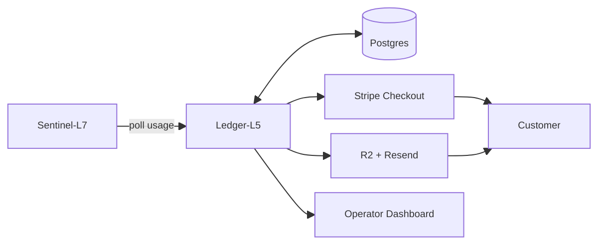
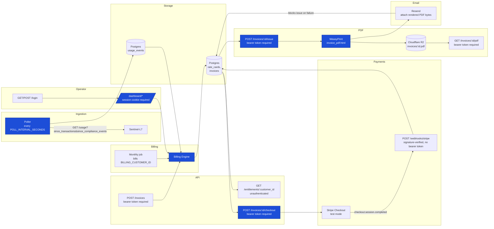

<p align="center">

</p>

**Ledger-L5** is a **billing and usage-metering service** for Sentinel-L7. It pulls usage events on a schedule, tracks per-customer entitlements, issues invoices, and now has a small operator dashboard for looking at all of that.

Architecturally, this project is a **scheduled pull-based metering pipeline**: a single service polls an upstream usage source on an interval, rates and invoices that usage through an internally-owned billing engine, and hands collection/delivery off to external providers (Stripe, R2, Resend) that are never trusted with domain authority.

---



---

## 📋 Contents

- [🧰 Stack](#-stack)
- [🚀 Running the Project](#-running-the-project)
- [🏗️ Architecture](#-architecture)
  - [🔀 Pipeline Diagram](#-pipeline-diagram)
  - [🗂️ Operational Planes](#️-operational-planes)
  - [📐 Scale Design](#-scale-design)
  - [🧩 Python Patterns](#-python-patterns)
- [📚 Docs](#-docs)
- [🗺️ Roadmap](#️-roadmap)
  - [📋 Planned](#-planned)
  - [🐛 Known issues](#-known-issues)
  - [📦 Production-Ready Baseline](#-production-ready-baseline)

## 🧰 Stack

The Ledger-L5 engine is a single Python service, grouped below by operational domain.

**🧱 Core Engine & API**

- **Python 3.12 + uv:** dependency management and virtual environments, chosen for fast, reproducible installs.
- **FastAPI:** the HTTP layer for both the JSON API and the operator dashboard's routing.
- **Pydantic v2:** request/response schema validation.
- **Jinja2** (FastAPI's built-in `Jinja2Templates`) **+ HTMX** (CDN, loaded but not yet used): server-rendered operator dashboard, no SPA/JS build ([ADR 0012](docs/adr/0012-operator-auth-and-dashboard.md)).

**🗄️ Data & Domain Integrity**

- **Postgres on [Neon](https://neon.tech):** sole data store; `main` branch for dev, `test` branch for the pytest suite.
- **SQLAlchemy 2.0** (sync, `psycopg` v3 driver) **+ Alembic:** fully-typed models and migrations.
- **pytest + factory_boy:** test stack, run against real Postgres, never SQLite — [ADR 0011](docs/adr/0011-test-stack.md).
- **`Decimal`/`NUMERIC` everywhere money is stored:** never `float`, to avoid floating-point imprecision in billing math.

**🔗 Ingestion & Scheduling**

- **httpx:** the Sentinel-L7 usage-pull client ([ADR 0003](docs/adr/0003-pull-not-push.md), [ADR 0005](docs/adr/0005-sentinel-l7-usage-pull-contract.md)).
- **APScheduler** (in-process `BackgroundScheduler`): real scheduling for the poller and monthly invoice generation ([ADR 0010](docs/adr/0010-scheduling.md)).

**💳 Payments, PDF & Delivery**

- **`stripe`** (official Python SDK): test-mode-only Checkout Sessions and webhook signature verification for payment collection ([ADR 0013](docs/adr/0013-stripe-for-payment-collection-only.md)).
- **WeasyPrint:** renders `invoice_pdf.html` to PDF bytes ([ADR 0014](docs/adr/0014-pdf-invoice-generation-weasyprint.md)); deployed on Railway via a root `railpack.json` (`deploy.aptPackages`), since Railway's current default builder (Railpack) needs the libraries in the final runtime image.
- **`boto3`:** S3-compatible client pointed at Cloudflare R2 for durable invoice PDF storage ([ADR 0015](docs/adr/0015-cloudflare-r2-invoice-pdf-storage.md)).
- **Resend** (via `httpx`, no SDK dependency): emails the rendered invoice PDF to the customer as an attachment when an invoice is issued ([ADR 0016](docs/adr/0016-automatic-invoice-email-delivery.md)).

See [ADR 0001](docs/adr/0001-build-ledger-l5-in-python-fastapi.md) for why this stack was chosen over the `ledger-l5-rails` prior art.

## 🚀 Running the Project

### ✅ Prerequisites

- **Python 3.12+**
- **[uv](https://docs.astral.sh/uv/)**
- A `.env` with `DATABASE_URL` pointing at the Neon `main` branch, plus `OPERATOR_API_TOKEN`, `SESSION_SECRET_KEY`, `STRIPE_SECRET_KEY`, `STRIPE_WEBHOOK_SECRET`, `R2_ACCOUNT_ID`, `R2_ACCESS_KEY_ID`, `R2_SECRET_ACCESS_KEY`, `R2_BUCKET_NAME`, `RESEND_API_KEY`, and `RESEND_FROM_EMAIL` (all ten required — the app fails to start without them, same as `DATABASE_URL`; see `.env.example`). Stripe keys must be **test-mode** (`sk_test_...`/`whsec_...`) — ADR 0013. R2 credentials are a scoped R2 API token pair, not a Cloudflare account login — ADR 0015. `RESEND_FROM_EMAIL` needs a real, verified sending address before an invoice email can actually leave Resend's sandbox — ADR 0016.

### ⚡ Quick Start

```bash
# 1. Install dependencies
uv sync

# 2. Apply migrations
uv run alembic upgrade head

# 3. Start the app
uv run uvicorn app.main:app --reload

# 4. Open the interactive API docs
open http://localhost:8000/docs

# 5. Or log into the operator dashboard directly
open http://localhost:8000/login
```

Starting the app also starts the in-process scheduler (poller every `POLL_INTERVAL_SECONDS`, monthly invoice job on the 1st — [ADR 0010](docs/adr/0010-scheduling.md)), which will try to reach `sentinel_l7_base_url` for real. If Sentinel-L7 isn't actually running locally, set `ENABLE_SCHEDULER=false` in `.env` to start the app without it — `POST /invoices` still works for manual/smoke-test runs either way.

At `/login`, enter `OPERATOR_API_TOKEN`'s value as the token to reach the dashboard (`/dashboard/invoices`, `/dashboard/usage-events`, `/dashboard/generate-invoice`). API clients skip the login form and send `Authorization: Bearer <OPERATOR_API_TOKEN>` directly — required now on `POST /invoices` ([ADR 0012](docs/adr/0012-operator-auth-and-dashboard.md)).

### 🧪 Running Tests

Tests run against the Neon `test` branch, configured via `.env.test`:

```bash
uv run pytest
```

Domain logic covers Phases 1–10 so far (foundations, usage ingestion, entitlements, billing engine, scheduling, operator auth/dashboard, Stripe payment collection, PDF invoice generation, R2 PDF storage, automatic invoice email delivery). The test suite runs with `ENABLE_SCHEDULER=false` (`.env.test`) so it never starts a real background scheduler, and never calls a real Stripe, R2, or Resend API — `StripeClient` is only exercised through a hand-written `FakeStripeClient`, `R2Client` only through a hand-written `FakeObjectStorageClient`, `ResendClient` only through a hand-written `FakeEmailClient`, and webhook signature verification is tested against real HMAC signatures signed with the test-only `STRIPE_WEBHOOK_SECRET`. Seed a placeholder rate card with:

```bash
uv run python -m scripts.seed_rate_card
```

## 🏗️ Architecture

### 🔀 Pipeline Diagram



### 🗂️ Domains

| Domain  | Purpose & Responsibilities | Key Components & Files |
| :--- | :--- | :--- |
| **📥 Ingestion** | Pulls usage events from Sentinel-L7 on an interval, classifying them at pull time ([ADR 0003](docs/adr/0003-pull-not-push.md), [ADR 0005](docs/adr/0005-sentinel-l7-usage-pull-contract.md)). | `services/usage_poller.py`, `services/usage_ingestion.py`, `integrations/sentinel_l7.py` |
| **💰 Billing Engine** | Rates usage against rate cards and generates draft invoices; owns `transition_status()`, the one sanctioned way an invoice's state changes ([ADR 0008](docs/adr/0008-configurable-billing-rules-engine.md), [ADR 0009](docs/adr/0009-immutable-historical-invoices.md)). | `services/billing.py`, `models/rate_card.py`, `models/invoice.py`, `models/invoice_line_item.py` |
| **🔌 Entitlements & Invoice API** | HTTP surface for Sentinel-L7's entitlement polling and operator/manual invoice generation ([ADR 0004](docs/adr/0004-entitlement-throttle-poll-endpoint.md)). | `api/entitlements.py`, `api/invoices.py` |
| **💳 Payments** | Stripe Checkout session creation and signature-verified webhook handling; drives the `issued → paid` transition ([ADR 0013](docs/adr/0013-stripe-for-payment-collection-only.md)). | `services/payments.py`, `api/webhooks.py`, `integrations/stripe.py`, `models/stripe_event.py` |
| **📨 Delivery** | Orchestrates the `issue` transition: PDF render, R2 upload (degrades on failure), Resend email (blocks on failure) ([ADR 0014](docs/adr/0014-pdf-invoice-generation-weasyprint.md)–[ADR 0016](docs/adr/0016-automatic-invoice-email-delivery.md)). | `services/invoice_issuance.py`, `services/invoice_pdf.py`, `integrations/object_storage.py`, `integrations/email.py` |
| **🖥️ Operator Dashboard** | Bearer-token/session auth and a server-rendered Jinja2 UI for invoices, usage events, and manual invoice generation ([ADR 0012](docs/adr/0012-operator-auth-and-dashboard.md)). | `web/auth.py`, `web/dashboard.py`, `app/auth.py`, `templates/*.html` |

Deeper behavioral detail per domain — the `usage_events`/customer-linkage gap, Stripe's idempotent-reuse logic, the R2-degrades-vs-Resend-blocks asymmetry, and more — lives in [docs/ARCHITECTURE.md](docs/ARCHITECTURE.md), not here.

### 📐 Scale Design

> [!NOTE]
> Ledger-L5 runs as a **single writer** — one instance with an in-process APScheduler, not a Competing-Consumers queue architecture. A second replica would double-run the poller and the monthly billing job today; see the Roadmap's duplicate-invoice-guard item before that changes ([ADR 0010](docs/adr/0010-scheduling.md)).

### 🧩 Python Patterns

* Protocol-based client interfaces, not ABCs — `EmailClient`, `ObjectStorageClient`, `UsagePullClient`, `CheckoutClient` in `app/integrations/`; zero `ABC`/`abstractmethod` anywhere in `app/`.
* Fail-fast settings — required env vars in `app/config.py` are bare annotations with no default; `settings = Settings()` at import time crashes on startup, not on first request.
* `Decimal`/`NUMERIC` for all money, never `float` — one `_to_cents` conversion boundary in `integrations/stripe.py`, where cents-as-int is unavoidable.
* Fully-typed SQLAlchemy 2.0 ORM — `Mapped[...]`/`mapped_column` throughout, no legacy `Column()` style.
* DI via FastAPI `Depends()`, not a mocking library — `get_session`, `get_stripe_client`, `get_storage_client`, `get_email_client` swapped per-test with `app.dependency_overrides[...]`.
* Tests run on real Postgres, not SQLite — the `db_session` fixture uses `join_transaction_mode="create_savepoint"` so route-level commits land on a nested SAVEPOINT the outer test transaction discards.
* One sanctioned mutation point per aggregate — `transition_status()` is the only place an invoice's status/financial fields change, gated by a linear `VALID_TRANSITIONS` state machine.
* factory_boy for model construction in tests — e.g. `CustomerFactory`, not dict fixtures.

## 📚 Docs

| File | Contents |
| --- | --- |
| [README.md](README.md) | Project overview |
| [ARCHITECTURE.md](docs/ARCHITECTURE.md) | Operational planes (expanded), pipeline diagram, state machines, failure-handling matrix — system-behavior detail that doesn't belong in README |
| [USER_STORIES.md](docs/USER_STORIES.md) | User stories by domain — implemented, aspirational, and deliberately deferred |
| [adr/](docs/adr/) | Architecture Decision Records |
| [journal/](docs/journal/) | Engineering journal — one entry per phase |
| [probes/](docs/probes/) | Anki spaced-repetition probe cards, paired with journal entries |

## 🗺️ Roadmap

This project is built ADR-first: each build phase produces a committed Architecture Decision Record before any code that implements it — see [docs/adr/](docs/adr/).

### 📋 Planned

- [ ] **Scope invoice generation to a specific customer** once Sentinel-L7 usage events carry a `customer_id` — `create_draft_invoice` currently bills all billable usage for a product/metric/period to whichever single customer it's given, correct only while exactly one customer exists. ([ADR 0005](docs/adr/0005-sentinel-l7-usage-pull-contract.md), [ADR 0008](docs/adr/0008-configurable-billing-rules-engine.md))
- [ ] **Verify the Sentinel-L7 usage-pull contract against a live endpoint** once Sentinel-L7's own ADR-0029 is Accepted — Phase 2 is built and tested entirely against fixtures matching the documented `GET /usage` shape today. ([ADR 0003](docs/adr/0003-pull-not-push.md), [ADR 0005](docs/adr/0005-sentinel-l7-usage-pull-contract.md))
- [ ] **Design and wire real entitlement-throttle rules** — `GET /entitlements/:customer_id` always returns `throttled: false` today; real rules are downstream of the rate-card work. ([ADR 0004](docs/adr/0004-entitlement-throttle-poll-endpoint.md))
- [ ] **Add a dashboard "Pay" button and email the Stripe Checkout link automatically** — a payer currently has to be sent the link manually. ([ADR 0013](docs/adr/0013-stripe-for-payment-collection-only.md))
- [ ] **Enforce invoice immutability at the database layer** (a trigger or `REVOKE UPDATE`), not just by omission in the service layer — nothing today stops a direct SQL client or future admin tool from mutating a line item or issued invoice's financial fields. ([ADR 0009](docs/adr/0009-immutable-historical-invoices.md))
- [ ] **Add a duplicate-invoice guard** before generating a new invoice for the same customer/product/metric/period — reachable today from a manual re-run alone, not only from a future multi-replica deploy. ([ADR 0010](docs/adr/0010-scheduling.md))
- [ ] **Decide the zero-usage invoice policy** — skip vs. issue a $0 invoice for record-keeping; a zero-usage period currently always produces a draft invoice with zero line items. ([ADR 0010](docs/adr/0010-scheduling.md))
- [ ] **Add a manual PDF regenerate/retry action** for an issued invoice whose `pdf_object_key` is still null after a failed R2 upload. ([ADR 0015](docs/adr/0015-cloudflare-r2-invoice-pdf-storage.md))
- [ ] **Add a resend action** for an already-issued invoice's email — today the only way to "retry" a notification is to re-run `issue` from a `draft` invoice, which doesn't help once an invoice is already issued. ([ADR 0016](docs/adr/0016-automatic-invoice-email-delivery.md))

### 🐛 Known issues

Each item below is a deliberate, currently-correct design boundary, not a bug — read as "true today, stays this way unless its trigger condition occurs," not "broken."

- **`GET /entitlements/{customer_id}` has no auth**, unlike every other route since Phase 6 added bearer-token auth to `POST /invoices` and the whole `/dashboard/*` surface. It's Sentinel-L7 polling machine-to-machine, and ADR 0004's fail-open contract for that consumer is a different, still-valid design, not an oversight. No access control on the `customers` table directly either, beyond what the routes above enforce. **Stays this way unless:** this endpoint's consumer changes from "Sentinel-L7 only, trusted network" to something else. ([ADR 0004](docs/adr/0004-entitlement-throttle-poll-endpoint.md), [ADR 0007](docs/adr/0007-customer-model-no-multi-tenancy.md))
- **No dedicated handling for an abandoned Stripe Checkout session.** Stripe pushes an `expired` event, not a distinct "canceled" one, when a payer closes the tab without paying — the idempotent-reuse behavior in `POST /invoices/{id}/checkout` means a payer who comes back later just resumes (or regenerates, once expired) the same flow, left to Stripe's own session lifecycle rather than distinguished server-side. ([ADR 0013](docs/adr/0013-stripe-for-payment-collection-only.md))
- **Stripe is test-mode only.** Switching to a live account (real API keys) is the concrete trigger for revisiting this ADR — nothing about the architecture changes, only the fact that a real charge becomes possible. ([ADR 0013](docs/adr/0013-stripe-for-payment-collection-only.md))
- **A Resend outage or misconfiguration blocks invoicing entirely**, not just email delivery — a strictly larger blast radius than R2's degrade-on-failure handling, accepted deliberately because "the customer has been notified" is part of what `issued` means. ([ADR 0016](docs/adr/0016-automatic-invoice-email-delivery.md))
- **An email failure after a successful R2 upload leaves an orphaned object in the bucket** — the upload isn't rolled back, only the DB transaction is. Harmless. ([ADR 0016](docs/adr/0016-automatic-invoice-email-delivery.md))

### 📦 Production-Ready Baseline

> [!TIP]
> **11 phases shipped (0–10)** | **66 tests passing**

<details>
<summary>🔍 View shipped features...</summary>

#### 🧱 Foundations & Usage Ingestion
* Repo scaffold — `uv`-managed FastAPI + Pydantic v2 skeleton, `docs/adr/` established ([ADR 0001](docs/adr/0001-build-ledger-l5-in-python-fastapi.md))
* pytest + factory_boy test stack against real Postgres (Neon branches), UUID primary keys, `customers` table, no multi-tenancy ([ADR 0002](docs/adr/0002-uuid-primary-keys.md), [ADR 0007](docs/adr/0007-customer-model-no-multi-tenancy.md), [ADR 0011](docs/adr/0011-test-stack.md))
* Usage ingestion — pull contract with Sentinel-L7, `usage_events` table, ADR-0028 billing classification at pull time ([ADR 0003](docs/adr/0003-pull-not-push.md), [ADR 0005](docs/adr/0005-sentinel-l7-usage-pull-contract.md), [ADR 0006](docs/adr/0006-single-hardcoded-product-no-plugin-system.md))

#### 💳 Entitlements & Billing Engine
* `GET /entitlements/:customer_id` — stubbed `throttled: false`, caller-side fail-open documented ([ADR 0004](docs/adr/0004-entitlement-throttle-poll-endpoint.md))
* Billing engine — rate cards, override precedence, append-only invoices with rate snapshotted onto line items at issue time ([ADR 0008](docs/adr/0008-configurable-billing-rules-engine.md), [ADR 0009](docs/adr/0009-immutable-historical-invoices.md))

#### ⏱️ Scheduling & Operator Dashboard
* In-process scheduler — polls on an interval and bills one designated customer monthly; `POST /invoices` covers any customer/custom range on demand; minimal Railway `Procfile` ([ADR 0010](docs/adr/0010-scheduling.md))
* Operator auth and dashboard — static bearer-token auth (also required on `POST /invoices`); server-rendered Jinja2 dashboard for invoices, usage events, and manual invoice generation ([ADR 0012](docs/adr/0012-operator-auth-and-dashboard.md))

#### 💰 Payments (Stripe)
* Stripe Checkout — `POST /invoices/{id}/checkout` creates a test-mode Checkout Session for an issued invoice, idempotent per invoice; `POST /webhooks/stripe` verifies signatures and moves `issued → paid` on `checkout.session.completed`, resolved via Stripe session metadata rather than the mutable session-ID column ([ADR 0013](docs/adr/0013-stripe-for-payment-collection-only.md))

#### 🧾 Invoice PDF, Storage & Delivery
* PDF invoice generation — WeasyPrint renders a dedicated `invoice_pdf.html` template via `app/services/invoice_pdf.py`; Railway/Railpack `deploy.aptPackages` build path verified against a live build and a real WeasyPrint render ([ADR 0014](docs/adr/0014-pdf-invoice-generation-weasyprint.md))
* Invoice PDF storage (Cloudflare R2) — `POST /invoices/{id}/issue` transitions a draft invoice, renders its PDF, and uploads it to R2 (`invoices/{invoice_id}.pdf`) in one request; upload failure is logged but never fails the transition; retrieved via `GET /invoices/{id}/pdf` under the same operator auth; verified against a live R2 bucket ([ADR 0015](docs/adr/0015-cloudflare-r2-invoice-pdf-storage.md))
* Automatic invoice email delivery — `app/services/invoice_issuance.py` emails the rendered PDF bytes to the customer via Resend as an attachment on issue; unlike the R2 upload, a failed send blocks and rolls back the whole transition, since `issued` is documented to mean "the customer has been notified"; the dashboard's issue form (and the JSON API's optional `customer_email` field) lets an operator edit the customer's email inline, which persists to the `Customer` row ([ADR 0016](docs/adr/0016-automatic-invoice-email-delivery.md))

</details>
