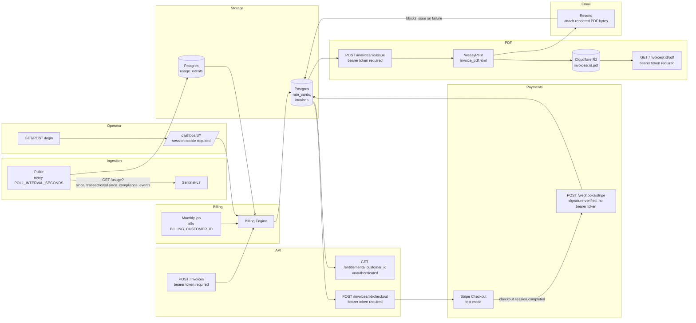

# Architecture

System-behavior detail for Ledger-L5 that doesn't belong in [README.md](../README.md) — the README's [Pipeline Diagram](../README.md#-pipeline-diagram) and [Operational Planes](../README.md#️-operational-planes) table are the entry point; this document is where each plane's real behavior, the data model's open gaps, the state machines, and the failure-handling posture live instead of being restated across six paragraphs of prose.

Decisions and their rationale live in [docs/adr/](adr/), not here — this document describes *what the system currently does*, cross-referencing the ADR that decided it rather than re-arguing it.

---

## Operational Planes (expanded)

### 📥 Ingestion

`usage_events` (pulled from Sentinel-L7, classified per its own ADR-0028 at pull time — [ADR 0005](adr/0005-sentinel-l7-usage-pull-contract.md)) has **no `customer_id`** — Sentinel-L7 has no customer/tenant model to pull one from (its own ADR-0020). This is an open gap, not an oversight; see [Data Model Notes](#data-model-notes) below. The poll cursor is two independent integers (`since_transactions`, `since_compliance_events`), not a timestamp — [ADR 0003](adr/0003-pull-not-push.md) — per Sentinel-L7's own companion ADR-0029 for the endpoint contract. Not yet exercised against a live Sentinel-L7 (see README's Roadmap).

The poller runs every `POLL_INTERVAL_SECONDS` (default 60) via an in-process APScheduler ([ADR 0010](adr/0010-scheduling.md)) — see [Scale Design](../README.md#-scale-design) for why this doesn't horizontally scale today.

### 💰 Billing Engine

`GET /entitlements/{customer_id}` ([ADR 0004](adr/0004-entitlement-throttle-poll-endpoint.md)) is live but stubbed — always `throttled: false` until real throttle rules are wired in. `rate_cards` (customer-specific rows override a nullable-`customer_id` product default), `invoices`, and `invoice_line_items` exist per [ADR 0008](adr/0008-configurable-billing-rules-engine.md)/[ADR 0009](adr/0009-immutable-historical-invoices.md) — line items snapshot their rate at issue time, so editing `rate_cards` afterward never changes an issued invoice.

Invoice generation bills *all* billable usage for a product/metric/period to whichever customer is invoiced, unscoped by customer — a direct consequence of the `usage_events` gap above, correct only while there's one implicit customer. That's why the monthly scheduled job bills exactly one designated customer (`BILLING_CUSTOMER_ID`) rather than looping every row in `customers` — [ADR 0010](adr/0010-scheduling.md). `POST /invoices` generates a draft invoice on demand for any customer and any `period_start`/`period_end` — the way to bill someone other than the designated customer, or smoke-test a specific historical range.

### 🔌 Entitlements & Invoice API

`GET /entitlements/{customer_id}` is the one deliberate exception to bearer-token auth — left unauthenticated on purpose, since it's Sentinel-L7 polling machine-to-machine with a different, fail-open contract ([ADR 0004](adr/0004-entitlement-throttle-poll-endpoint.md)). Every other route added since Phase 6 requires either a bearer token (`OPERATOR_API_TOKEN`) or a signed session cookie ([ADR 0012](adr/0012-operator-auth-and-dashboard.md)).

### 💳 Payments

`POST /invoices/{id}/checkout` creates a test-mode Stripe Checkout Session for an `issued` invoice's total, **idempotently** — a repeat call reuses the existing session's URL as long as it's still `open`, only minting a new one if none exists yet or the prior one expired ([ADR 0013](adr/0013-stripe-for-payment-collection-only.md)). `POST /webhooks/stripe` is the one route with no operator-token auth at all — it verifies the `Stripe-Signature` header over the raw request body instead, resolves the invoice via Stripe's own echoed-back `metadata.invoice_id` (never the mutable `stripe_checkout_session_id` column), and moves `issued → paid` on `checkout.session.completed`. A `stripe_events` table records processed event IDs so a retried webhook delivery is a no-op, not a second state transition. Stripe never meters usage or finalizes an invoice — it is only ever told a final number and asked to collect it.

### 📨 Delivery

`POST /invoices/{id}/issue` is the one route that calls `transition_status(invoice, "issued")`, and the only place PDF generation, storage, and email delivery happen — all three in one request/commit:

1. `render_invoice_pdf()` renders `app/templates/invoice_pdf.html` (a separate template from the dashboard's `invoice_detail.html`, deliberately not sharing HTMX/nav chrome) via WeasyPrint into PDF bytes — a pure function, no DB session, no storage ([ADR 0014](adr/0014-pdf-invoice-generation-weasyprint.md)).
2. `store_pdf()` uploads those bytes to Cloudflare R2 under the deterministic key `invoices/{invoice_id}.pdf`, stored on `invoices.pdf_object_key` once upload succeeds ([ADR 0015](adr/0015-cloudflare-r2-invoice-pdf-storage.md)).
3. The same in-memory bytes (not the R2 copy) are emailed to the customer via Resend as an attachment ([ADR 0016](adr/0016-automatic-invoice-email-delivery.md)).

Steps 2 and 3 have **opposite failure semantics** — see the [Failure-Handling Matrix](#failure-handling-matrix) below. `GET /invoices/{id}/pdf` streams the R2 object back through this system's own auth rather than a public or presigned R2 URL, 404ing if no PDF has been generated yet.

### 🖥️ Operator Dashboard

A static bearer token (`OPERATOR_API_TOKEN`), checked directly via `Authorization: Bearer <token>` on JSON API routes, or via a signed session cookie (set by `/login`) on the server-rendered `/dashboard/*` pages — invoice list/detail, usage events, a manual generate-invoice form, and (as of Phase 10) an inline issue-invoice form with an editable customer email. The dashboard's forms call the same service functions the JSON API uses (`create_draft_invoice`, `issue_invoice`) — never a second HTTP call to itself ([ADR 0012](adr/0012-operator-auth-and-dashboard.md)).

---

## Data Model Notes

- **`usage_events` has no `customer_id`.** Sentinel-L7 has no customer/tenant model to pull one from. Every billing calculation that touches usage is implicitly single-customer until this is resolved — see README's Roadmap.
- **Rate-card override precedence.** A customer-specific `rate_cards` row (non-null `customer_id`) takes precedence over the nullable-`customer_id` product default for the same product/metric — [ADR 0008](adr/0008-configurable-billing-rules-engine.md).
- **Invoice immutability is enforced by omission, not the database.** No service function other than `transition_status()` mutates a line item or an issued invoice's financial fields — but nothing at the DB level (trigger, `REVOKE UPDATE`) stops a direct SQL client from doing so. See README's Roadmap for the concrete trigger to revisit this.
- **`customers.email` is the one mutable field on an otherwise append-only-ish model** — editable inline from the issue-invoice form as of [ADR 0016](adr/0016-automatic-invoice-email-delivery.md). `invoices.sent_to_email` is an immutable snapshot taken at send time, independent of later edits to `customers.email`.

## State Machines

**Invoice status** — a linear state machine gated by `VALID_TRANSITIONS` in `app/services/billing.py`'s `transition_status()`, the only sanctioned mutation point:

```
draft --[POST /invoices/{id}/issue]--> issued --[checkout.session.completed webhook]--> paid
```

No transition skips a state, and no function outside `transition_status()` writes `status`, `issued_at`, or `paid_at`.

**Stripe webhook idempotency** — `stripe_events(id)` has a unique constraint on Stripe's own event ID; a duplicate delivery hits an `IntegrityError` on insert, the route catches it, rolls back the just-attempted insert, and returns `{"status": "duplicate"}` without touching the invoice a second time.

## Failure-Handling Matrix

| Dependency | On failure | Why |
| --- | --- | --- |
| Sentinel-L7 (poll) | Poller logs and retries next interval; no invoice/entitlement state is touched by a failed poll | Polling is inherently retry-safe — there's always a next interval ([ADR 0003](adr/0003-pull-not-push.md)) |
| Stripe (Checkout session creation) | Uncaught — propagates as a 500 today | No degrade path has been built yet; not exercised as a real outage so far |
| Cloudflare R2 (PDF upload) | Caught and logged; `issued` transition proceeds regardless, `pdf_object_key` stays null | R2 is a durable copy, not a delivery guarantee — a null key is a checkable, recoverable degraded state ([ADR 0015](adr/0015-cloudflare-r2-invoice-pdf-storage.md)) |
| Resend (email send) | **Blocks** — the whole `issue` transaction rolls back, invoice stays `draft` | `issued` is documented to mean "the customer has been notified" — a silent non-delivery would be a false record, not a checkable gap ([ADR 0016](adr/0016-automatic-invoice-email-delivery.md)) |

The Resend/R2 asymmetry is the one place this system deliberately breaks its own "downstream integration failure never blocks a state transition" instinct — see ADR 0016's Rationale for why that's a considered exception, not a drift.

## Pipeline Diagram



## Open Gaps

Every known gap, its trigger condition for revisiting, and whether it's actionable now lives in README's [Planned](../README.md#-planned) and [Known issues](../README.md#-known-issues) sections — not duplicated here.
