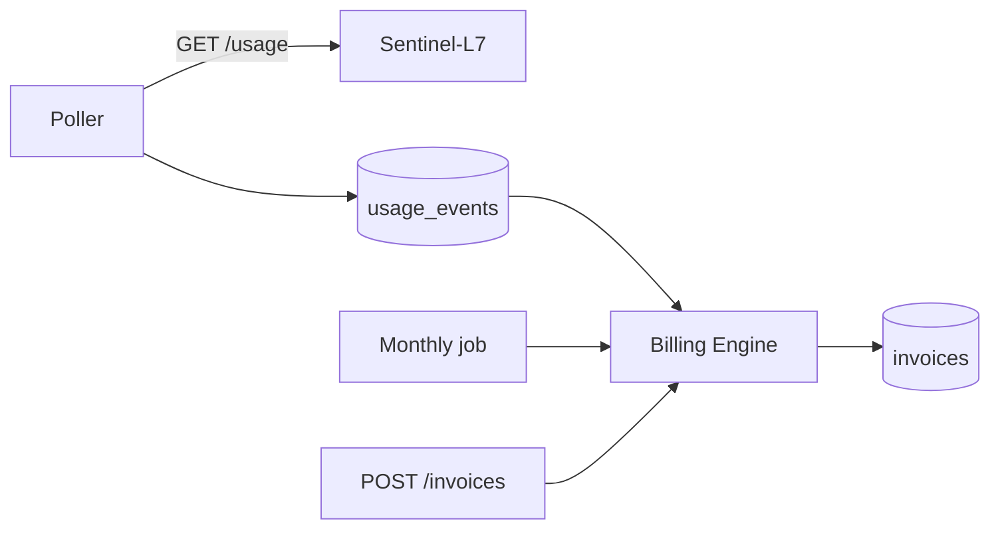

Ledger-L5's poller and monthly invoice job run inside the FastAPI process via an APScheduler {{c1::BackgroundScheduler}}, started from FastAPI's {{c2::lifespan}} context manager — not a separate worker process, not an external cron hitting HTTP endpoints.

Extra: ledger-l5 · Pattern: In-Process Scheduling via a Lifespan-Managed Background Thread
See: docs/journal/ledger-l5-2026-07-10T0230-scheduling.md

---
type: cloze
deck: Rhizome::ledger-l5
tags: [ledger-l5, billing-correctness]
---
Looping every row in `customers` for the monthly auto-invoice job would overbill, because {{c1::usage_events has no customer_id}} — `create_draft_invoice` bills the {{c2::entire}} usage total for a product/metric/period to whichever single customer it's given, so each looped customer would be charged the full total independently.

Extra: ledger-l5 · Anti-Pattern Avoided: Fabricating Multi-Tenant Correctness via a Naive Batch Loop
See: docs/journal/ledger-l5-2026-07-10T0230-scheduling.md

---
type: cloze
deck: Rhizome::ledger-l5
tags: [ledger-l5, test-isolation]
---
`{{c1::enable_scheduler}}` is set to `False` in `.env.test` so pytest's `TestClient` — which runs the real FastAPI lifespan — never starts a real background scheduler against a live Sentinel-L7 or an untracked DB session.

Extra: ledger-l5 · Decision: enable_scheduler Flag to Keep the Test Suite Honest
See: docs/journal/ledger-l5-2026-07-10T0230-scheduling.md

---
type: cloze
deck: Rhizome::ledger-l5
tags: [ledger-l5, decimal-arithmetic]
---
`invoice_line_items.unit_rate`/`.line_total` are `{{c1::NUMERIC(12,4)}}`/`NUMERIC(14,4)` columns, so API responses serialize as `{{c2::"2.5000"}}`, not `"2.50"` — a test asserting two-decimal strings against these fields will fail.

Extra: ledger-l5 · Challenge: NUMERIC(12,4) Response Precision Didn't Match Hand-Written Test Expectations
See: docs/journal/ledger-l5-2026-07-10T0230-scheduling.md

---
type: basic
deck: Rhizome::ledger-l5
tags: [ledger-l5, decision]
---
Q: Why does Ledger-L5's automatic monthly invoice job bill only one designated customer (`billing_customer_id`) instead of looping every row in `customers`?

A: Because `usage_events` isn't scoped by customer — `create_draft_invoice` bills all billable usage for a product/metric/period to whichever single `customer_id` it's given. Looping all customers would bill each one the entire usage total independently, an active correctness bug, not just an incomplete feature. Billing one designated customer automatically is the only automatic behavior that stays correct under that constraint; a manual `POST /invoices` endpoint (any customer, any date range) covers everything else, including smoke-testing before the Phase 6 dashboard exists.

Extra: ledger-l5 · Decision: Single Designated Auto-Bill Customer, Manual Endpoint for Everything Else
See: docs/journal/ledger-l5-2026-07-10T0230-scheduling.md

---
type: image-occlusion
deck: Rhizome::ledger-l5
tags: [ledger-l5, topology]
diagram: ledger-l5-phase5-scheduling
---
occlusions:
  - node: A[Poller]
    hint: what runs on IntervalTrigger every POLL_INTERVAL_SECONDS?
    rect: left=.05:top=.10:width=.20:height=.10
  - node: M[Monthly job]
    hint: what runs on CronTrigger(day=1, hour=0, minute=5) and bills BILLING_CUSTOMER_ID?
    rect: left=.38:top=.45:width=.22:height=.10
  - node: G[POST /invoices]
    hint: what endpoint bills any customer for a custom period_start/period_end?
    rect: left=.38:top=.75:width=.26:height=.10

Header: Ledger-L5 Phase 5 scheduling topology
Back Extra: ledger-l5 · Pattern: In-Process Scheduling via a Lifespan-Managed Background Thread
See: docs/journal/ledger-l5-2026-07-10T0230-scheduling.md

