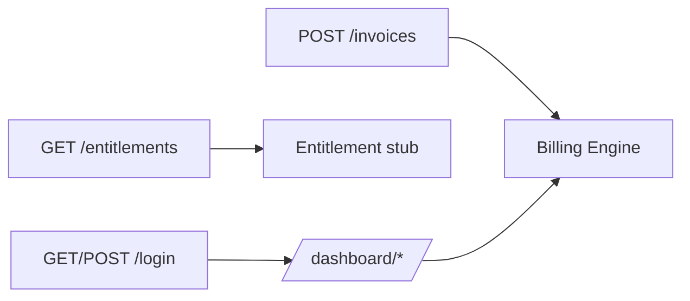

Ledger-L5's operator auth checks a bearer token using `{{c1::secrets.compare_digest}}`, not `==`, specifically to avoid a {{c2::timing side-channel}} on token comparison.

Extra: ledger-l5 · Pattern: Two Thin Auth Dependencies, One Shared Check
See: docs/journal/ledger-l5-2026-07-10T0400-operator-auth-and-dashboard.md

---
type: cloze
deck: Rhizome::ledger-l5
tags: [ledger-l5, auth-design]
---
`require_operator_json` and `require_operator_browser` both call the same `{{c1::token_matches()}}` helper, but fail differently: the JSON dependency raises a `{{c2::401}}`, while the browser dependency redirects to `{{c3::/login}}` — because a curl script and a human in a browser need different failure UX for the same underlying check.

Extra: ledger-l5 · Pattern: Two Thin Auth Dependencies, One Shared Check
See: docs/journal/ledger-l5-2026-07-10T0400-operator-auth-and-dashboard.md

---
type: cloze
deck: Rhizome::ledger-l5
tags: [ledger-l5, htmx]
---
A real `{{c1::303}}` redirect to a full different page doesn't compose cleanly with `hx-post` — the redirect gets followed at the {{c2::XHR}} level and the resulting full-page HTML gets swapped into a fragment target, producing broken nested markup, unless the `{{c3::HX-Redirect}}` response header convention is used instead.

Extra: ledger-l5 · Decision: Plain Form POST Over hx-post for Generate-Invoice
See: docs/journal/ledger-l5-2026-07-10T0400-operator-auth-and-dashboard.md

---
type: cloze
deck: Rhizome::ledger-l5
tags: [ledger-l5, testing]
---
An unnecessary `{{c1::session.rollback()}}` in the `NoApplicableRateError` branch of `generate_invoice_submit` rolled back the *outer* test fixture's own transaction (since the session shares a connection with the `db_session` fixture's `transaction.begin()`), producing a `{{c2::"transaction already deassociated from connection"}}` SAWarning at teardown.

Extra: ledger-l5 · Challenge: An Unnecessary session.rollback() Tripped a SQLAlchemy Warning in Tests
See: docs/journal/ledger-l5-2026-07-10T0400-operator-auth-and-dashboard.md

---
type: basic
deck: Rhizome::ledger-l5
tags: [ledger-l5, decision]
---
Q: A pasted draft ADR 0012 claimed its token-logging rule "matches ADR 0005's `X-Ledger-Api-Key`" and that ADR 0005 established "explicit 401, not fail-open." Why was this rejected, and what was cited instead?

A: Because it's false — ADR 0005 is Sentinel-L7's usage-pull *data* contract (cursors, classification), names no `X-Ledger-Api-Key` header, and says nothing about 401s or fail-open/fail-closed at all. Verified by reading ADR 0005 in full rather than trusting the citation. The real closest precedent is ADR 0004's entitlement endpoint, which is actually the *opposite* posture — fail-open — for a different, still-valid reason (a throttle check shouldn't block traffic during an outage; an operator-auth gate should). The final ADR cites ADR 0004 correctly as a deliberate divergence instead of repeating the false "match."

Extra: ledger-l5 · Anti-Pattern Avoided: Copying a False Precedent Into a New ADR
See: docs/journal/ledger-l5-2026-07-10T0400-operator-auth-and-dashboard.md

---
type: image-occlusion
deck: Rhizome::ledger-l5
tags: [ledger-l5, topology]
diagram: ledger-l5-phase6-auth-dashboard
---
occlusions:
  - node: L[GET/POST /login]
    hint: what route sets the signed session cookie after checking token_matches()?
    rect: left=.06:top=.60:width=.24:height=.10
  - node: G[POST /invoices]
    hint: which existing JSON route now requires require_operator_json?
    rect: left=.38:top=.10:width=.26:height=.10
  - node: Dash[/dashboard/*]
    hint: which routes require require_operator_browser (session cookie, not header)?
    rect: left=.38:top=.60:width=.26:height=.10
  - node: F[GET /entitlements]
    hint: which route stays deliberately unauthenticated, and why?
    rect: left=.70:top=.10:width=.26:height=.10

Header: Ledger-L5 Phase 6 auth/dashboard topology
Back Extra: ledger-l5 · Pattern: Two Thin Auth Dependencies, One Shared Check
See: docs/journal/ledger-l5-2026-07-10T0400-operator-auth-and-dashboard.md

