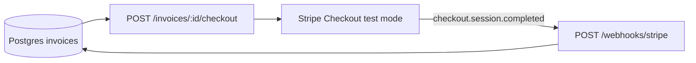

`POST /webhooks/stripe` inserts the Stripe event ID into `stripe_events` before acting on it; a duplicate delivery is caught as a {{c1::unique-constraint IntegrityError}} on that insert, not a separate {{c2::SELECT-then-INSERT}} existence check.

Extra: ledger-l5 · Pattern: Idempotent Receiver via Insert-Then-Conflict, Not Read-Then-Write
See: docs/journal/ledger-l5-2026-07-11T0100-stripe-payment-collection.md

---
type: cloze
deck: Rhizome::ledger-l5
tags: [ledger-l5, correlation-identifier, stripe]
---
The Stripe webhook resolves which invoice a `checkout.session.completed` event belongs to via `event.data.object.metadata.{{c1::invoice_id}}` — never the mutable `{{c2::stripe_checkout_session_id}}` column, since a second checkout call would overwrite that value.

Extra: ledger-l5 · Pattern: Correlation Identifier, Confirmed in the Implementation
See: docs/journal/ledger-l5-2026-07-11T0100-stripe-payment-collection.md

---
type: cloze
deck: Rhizome::ledger-l5
tags: [ledger-l5, stripe-sdk]
---
`stripe.Webhook.construct_event`'s return value is a `{{c1::StripeObject}}`, which supports bracket access but not `{{c2::.get()}}` — calling it raises a confusing `AttributeError` rather than a `TypeError`, fixed by calling `{{c3::.to_dict()}}` before handing the event to route logic.

Extra: ledger-l5 · Challenge: StripeObject Doesn't Support .get()
See: docs/journal/ledger-l5-2026-07-11T0100-stripe-payment-collection.md

---
type: cloze
deck: Rhizome::ledger-l5
tags: [ledger-l5, testing, sqlalchemy]
---
When a test `Session` is bound to a `Connection` with an externally-started `Transaction`, adding `{{c1::join_transaction_mode="create_savepoint"}}` makes each route-level commit/rollback operate on a nested `{{c2::SAVEPOINT}}` instead of the outer transaction — without it, one request's `rollback()` can undo an earlier request's already-"committed" work in the same test.

Extra: ledger-l5 · Challenge: A Shared Test Session's rollback() Undid an Earlier "Committed" Request
See: docs/journal/ledger-l5-2026-07-11T0100-stripe-payment-collection.md

---
type: cloze
deck: Rhizome::ledger-l5
tags: [ledger-l5, dependency-injection, fastapi]
---
`POST /invoices/{id}/checkout` uses `{{c1::Depends(get_stripe_client)}}` rather than instantiating `StripeClient()` directly in the route body — diverging from `SentinelL7Client`'s precedent, because this is the first route calling an external client that's exercised via `{{c2::TestClient}}` rather than only by calling a service function directly with a fake.

Extra: ledger-l5 · Decision: Depends(get_stripe_client) Diverging from SentinelL7Client's Precedent
See: docs/journal/ledger-l5-2026-07-11T0100-stripe-payment-collection.md

---
type: basic
deck: Rhizome::ledger-l5
tags: [ledger-l5, decision, http-semantics]
---
Q: Why does `POST /invoices/{id}/checkout` return 409, not 422, when called against a draft (not yet issued) invoice?

A: `422` on this router already means "the request itself is semantically invalid regardless of resource state" (e.g. `NoApplicableRateError` on `POST /invoices`). A checkout request against a draft invoice is well-formed but wrong-timing — a conflict between the request and the invoice's current state, which is the standard case for `409`. Keeping the two separate keeps `422` unambiguous as "bad request" rather than overloading it to also mean "bad timing."

Extra: ledger-l5 · Decision: 409 Conflict, Not 422, for a Non-issued Invoice on /checkout
See: docs/journal/ledger-l5-2026-07-11T0100-stripe-payment-collection.md

---
type: image-occlusion
deck: Rhizome::ledger-l5
tags: [ledger-l5, topology, stripe]
diagram: ledger-l5-phase7-stripe-topology
---
occlusions:
  - node: H[POST /invoices/:id/checkout]
    hint: which route creates or reuses a Stripe Checkout Session for an issued invoice?
    rect: left=.38:top=.28:width=.28:height=.10
  - node: S[Stripe Checkout test mode]
    hint: which external system hosts the actual payment page?
    rect: left=.72:top=.28:width=.24:height=.10
  - node: W[POST /webhooks/stripe]
    hint: which route has no OPERATOR_API_TOKEN auth at all, only signature verification?
    rect: left=.72:top=.55:width=.26:height=.10

Header: Ledger-L5 Phase 7 Stripe payment topology
Back Extra: ledger-l5 · Pattern: Correlation Identifier, Confirmed in the Implementation
See: docs/journal/ledger-l5-2026-07-11T0100-stripe-payment-collection.md

